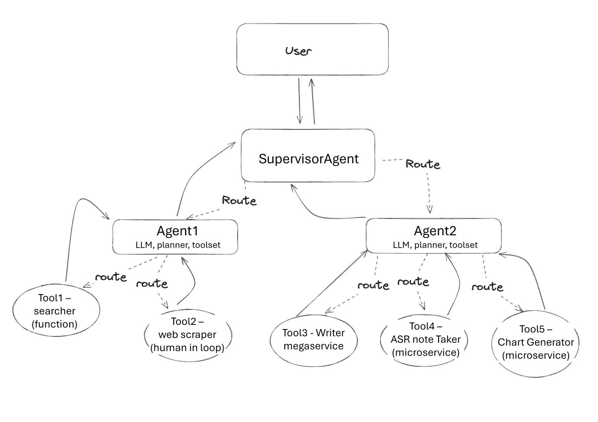

# MultiAgentsAssistant Application

Agent refers to a framework that integrates the reasoning capabilities of large language models (LLMs) with the ability to take actionable steps, creating a more sophisticated system that can understand and process information, evaluate situations, take appropriate actions, communicate responses, and track ongoing situations. 

Multi Agents refers to a design that leveraging a Hierarchical Agent Teams to complete sub-tasks through individual worker agent with their own LLM, tools, prompt and strategy; and then leveraging leveled supervisor agents to coodinate and provide final result. 


MultiAgentsQnA architecture example shows below: (User can provide different toolsets with configuration to design agents workflow)




# Launch MultiAgentsQnA Service

```bash
# config variables
export AGENT_SERVICE_PORT=9090
export LLM_SERVICE_PORT=8080
export SUPERVISOR_AGENT_PORT=9091
export RESEARCH_AGENT_PORT=9092
export WRITER_AGENT_PORT=9093

# launch services
cd docker/business_insight_assistant
docker compose -f docker-compose.yaml up -d
```